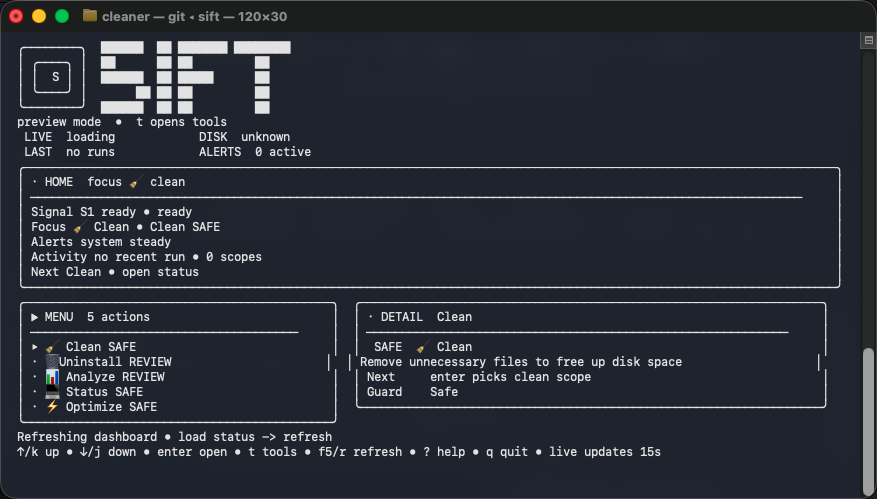
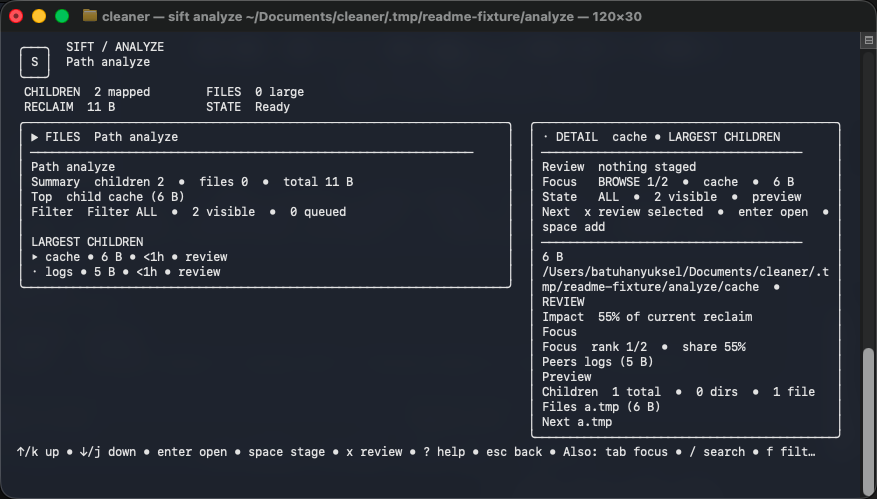
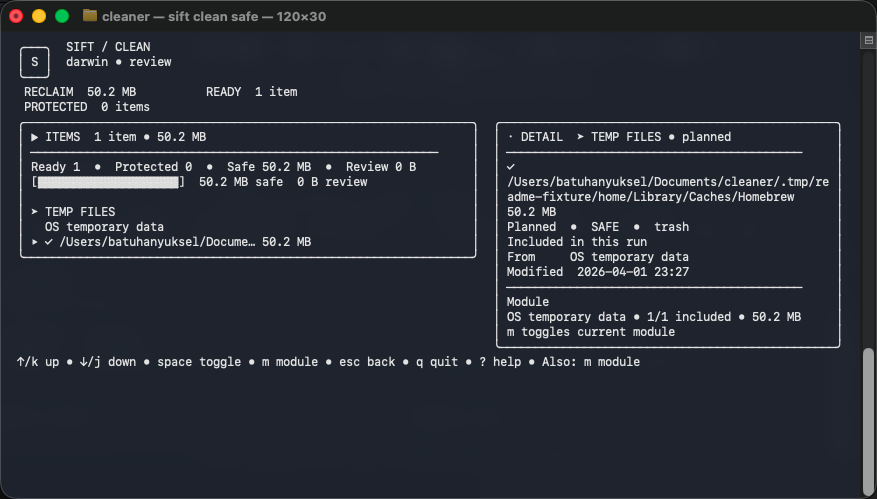

# SIFT

[](https://github.com/batu3384/sift/actions/workflows/ci.yml)
[](https://github.com/batu3384/sift/actions/workflows/release.yml)
[](LICENSE)

SIFT is a review-first terminal cleaner for macOS and Windows. It keeps the
workflow fast and terminal-native, but replaces shell-script cleanup logic with
a typed Go core, explicit safety policy, permission preflight, audit history,
and a single full-screen TUI that carries destructive work from selection to
execution without context switching.

Running `sift` opens the application shell. From there you can move through
`Home`, `Clean`, `Uninstall`, `Analyze`, `Status`, `Review`, `Permissions`,
`Progress`, and `Result` in one routed interface.

## Screenshots

Current captured screens are checked into `docs/assets/screenshots`. `Progress`,
`Permissions`, and `Result` captures are still release-readiness placeholders;
see [docs/SCREENSHOTS.md](docs/SCREENSHOTS.md) for the capture checklist before
publishing a release page or store listing.

<table>
  <tr>
    <td width="33%">
      
    </td>
    <td width="33%">
      
    </td>
    <td width="33%">
      
    </td>
  </tr>
  <tr>
    <td valign="top">
      <strong>Home</strong><br />
      Primary workflows, live state, and fast entry into cleanup or status.
    </td>
    <td valign="top">
      <strong>Analyze</strong><br />
      Explorer-style disk analysis with staged review handoff.
    </td>
    <td valign="top">
      <strong>Review</strong><br />
      Planned deletions, protected findings, and explicit execution control.
    </td>
  </tr>
</table>

## Why SIFT

- Review-first destructive flows. Cleanup is previewed before it is applied.
- Dry-run by default. Destructive non-interactive runs require both `--dry-run=false` and `--yes`.
- Cross-platform core. One Go binary with platform adapters for macOS and Windows.
- Explicit permission model. Admin, dialog, and native handoff requirements are shown before execution.
- Auditable behavior. Plans, executions, diagnostics, and reports are written to local state and audit logs.
- Task-native TUI. `clean`, `uninstall`, and staged `analyze` runs preload real preview plans so the selected work is visible before full review opens.

## Current Trust Status

This repository is prepared for public validation, but release claims should stay
tied to evidence:

| Area | Current status | Release gate |
| --- | --- | --- |
| Local tests | `go test ./...` passed for the pushed `main` baseline | Re-run before release tagging |
| Remote CI | `ci`, `codeql`, and `scorecard` pass on protected `main` | Keep required checks green on the release candidate |
| macOS CI-safe smoke | Runs in GitHub Actions and is available locally through `make smoke` | Re-run on the release candidate |
| Windows smoke | Runs in GitHub Actions on `windows-latest`; local script remains `make smoke-windows` | Re-run on Windows or a PowerShell-capable runner before public Windows claims |
| Live macOS integration | Explicit opt-in only | Must pass with `SIFT_LIVE_INTEGRATION=1` before broad macOS trust claims |
| Release artifacts | Local dry-run path exists | Must pass manifest preflight and tagged release workflow |

## Core Workflows

### Clean

Choose a cleanup scope, review planned findings, then execute through
`Review -> Permissions -> Progress -> Result`.

Profiles:

- `safe`: temp files, logs, obvious stale caches
- `developer`: safe plus developer and package-manager caches
- `deep`: broader cleanup with stronger review warnings

### Uninstall

Search installed apps, review remnants, optionally launch a native uninstall,
and continue in the same session through remnant cleanup and aftercare.

### Analyze

Inspect large directories and files, drill into folders, stage findings, and
send them into the standard cleanup review flow.

### Optimize and Autofix

Use the same reviewed execution model for safe maintenance actions and
autofixable posture findings.

## Install

### Install Script

```bash
curl -fsSL https://raw.githubusercontent.com/batu3384/sift/main/install.sh | sh
```

This installs `sift` and the short wrapper `si` into `~/.local/bin` by default.
Set `PREFIX=/custom/bin` to override the install location.

### Go Install

```bash
go install github.com/batu3384/sift/cmd/sift@latest
```

### Build From Source

```bash
git clone https://github.com/batu3384/sift.git
cd sift
go build -o ./sift ./cmd/sift
```

## Quick Start

```bash
# Launch the full-screen application shell
sift

# Open a reviewed cleanup plan for the safe profile
sift clean safe

# Analyze a path and stage items into cleanup review
sift analyze ~/Downloads

# Focused analysis helpers
sift duplicates ~/Downloads --json
sift largefiles ~/Downloads --min-size 100MB

# Live status in plain text or JSON
sift status --plain
sift status --json

# Local audit history and aggregate cleanup stats
sift history
sift stats --json

# Posture audit and reviewed autofix flow
sift check
sift autofix
```

## Safety Model

| Surface | Default posture | Explicit execution requirement |
| --- | --- | --- |
| `clean` | Preview plan first | TUI confirmation, or non-interactive `--dry-run=false --yes` |
| `purge` | Scan/review before removal | Explicit rule/path plus confirmation for destructive runs |
| `uninstall` | Plan app action and remnants first | Permission preflight plus explicit execution |
| `optimize` | Reviewed maintenance plan | Confirmation before applying native/system changes |
| `autofix` | Reviewed posture fixes | Confirmation before applying changes |
| `remove` | Planned self-removal | Explicit confirmation |
| `touchid` | Capability/preflight first | Explicit confirmation before system-level change |

Additional guardrails:

- Interactive destructive flows stay in the TUI and require explicit confirmation.
- Permission preflight summarizes admin, dialog, and native handoff requirements before execution.
- Protected paths, protected data families, and command-scoped exclusions are enforced by the same policy engine used during execution.
- JSON and non-interactive destructive runs never proceed unless intent is explicit.

## Platform and Command Matrix

| Command family | macOS | Windows | Notes |
| --- | --- | --- | --- |
| `status`, `doctor`, `history`, `stats`, `report` | Supported | Supported | Uses platform adapters for diagnostics and persistence |
| `analyze`, `duplicates`, `largefiles` | Supported | Supported | JSON output is available for automation |
| `clean`, `purge`, `protect` | Supported | Supported | Protection policy is shared; roots are platform-specific |
| `uninstall` | Supported with native handoff where available | Supported through Windows adapter behavior | Always review remnants before cleanup |
| `optimize`, `autofix` | Supported where checks are implemented | Supported where checks are implemented | Command output should describe skipped platform actions |
| `update`, `installer`, `remove`, `completion`, `version` | Supported | Supported | Package-manager availability depends on release artifacts |
| `touchid` | macOS-specific | Not applicable | Should report unsupported on Windows |

Known validation gaps before a public release:

- Remote GitHub Actions is passing on `main`; release tags should still be cut only from a freshly validated commit.
- Windows smoke is covered by GitHub Actions on `windows-latest`; rerun it for every release candidate.
- Live macOS integration requires opt-in host validation and should not be inferred from CI-safe smoke.

## Command Surface

```text
sift analyze [targets...]
sift duplicates [path]
sift largefiles [path] [--min-size 100MB]
sift check
sift clean [profile]
sift clean --whitelist [list|add <path>|remove <path>]
sift autofix
sift installer
sift purge <rule-or-path>
sift purge scan [roots...]
sift protect list
sift protect add <path>
sift protect remove <path>
sift protect explain <path>
sift protect family list
sift protect family add <family>
sift protect family remove <family>
sift protect scope list [command]
sift protect scope add <command> <path>
sift protect scope remove <command> <path>
sift uninstall <app>
sift optimize
sift optimize --whitelist [list|add <path>|remove <path>]
sift update
sift remove
sift status
sift history
sift stats
sift doctor
sift report [scan-id]
sift version
sift completion [shell]
sift touchid
```

## Output and Automation Notes

- `status`, `analyze`, and `check` automatically emit JSON when stdout is piped. Use `--plain` to force human-readable output.
- `doctor --json` emits the same diagnostic set used by the TUI.
- `analyze --json` emits a regular `ExecutionPlan`, matching interactive review.
- `status --json` emits a structured `StatusReport`.
- Set `SIFT_REDUCED_MOTION=1` to keep the TUI interactive while disabling spinner and pulse animation.

## Configuration

SIFT writes its user config to the platform config directory. See
[config.example.toml](config.example.toml) for the supported shape.

Important keys:

- `interaction_mode`: `auto`, `plain`, or `tui`
- `trash_mode`: `trash_first` or `permanent`
- `confirm_level`: `strict` or `balanced`
- `disabled_rules`: suppress specific built-in rule IDs
- `protected_paths`: never delete below these roots
- `protected_families`: enable broader built-in protection groups
- `command_excludes`: command-scoped exclusions such as `clean = ["~/Projects/keep-me/build"]`
- `purge_search_paths`: default roots for `sift purge scan`
- `diagnostics.redaction`: redact `$HOME` paths in debug bundles

## Development

```bash
go test ./...
make smoke
make quality-gate-full
./hack/security_check.sh
```

Other useful targets:

- `make integration-live-macos`
- `make cross-build`
- `make completions`
- `make release-dry-run`
- `make package-manifests TAG=v0.0.0-ci DIST_DIR=./.tmp/package-dist OUT_DIR=./.tmp/manifests`

README screenshots are generated from deterministic fixture roots with:

```bash
./hack/capture_readme_screens.sh
```

For docs-only changes, the minimum sanity pass is:

```bash
go test ./...
markdown link/reference sanity check for changed Markdown files
```

## Documentation

- [CHANGELOG.md](CHANGELOG.md)
- [CONTRIBUTING.md](CONTRIBUTING.md)
- [CODE_OF_CONDUCT.md](CODE_OF_CONDUCT.md)
- [SECURITY.md](SECURITY.md)
- [SECURITY_AUDIT.md](SECURITY_AUDIT.md)
- [docs/ARCHITECTURE.md](docs/ARCHITECTURE.md)
- [docs/RELEASE.md](docs/RELEASE.md)
- [docs/ROADMAP.md](docs/ROADMAP.md)
- [docs/SCREENSHOTS.md](docs/SCREENSHOTS.md)
- [docs/TESTING.md](docs/TESTING.md)
- [docs/MOLE_GAP_REPORT.md](docs/MOLE_GAP_REPORT.md)

## License

[MIT](LICENSE)
